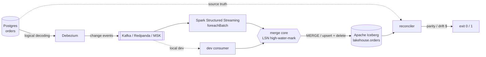

# cdc-streaming-pipeline

**Stream Postgres changes into an Apache Iceberg lakehouse with exactly-once,
out-of-order-correct upserts — and prove the lakehouse still matches the source.**


Change Data Capture (Debezium) publishes every insert, update, and delete to
Kafka. Kafka delivers those events **at-least-once** and **out of order**. A
naive consumer that applies them in arrival order silently corrupts the target:
stale values overwrite fresh ones and deleted rows come back. This project
applies them correctly, and ships a reconciler that catches it when they don't.

```
# The same out-of-order, duplicate-laden stream, two merge strategies:

$ cdcpipe run --stream stream.jsonl --warehouse /data --mode arrival   # naive
$ cdcpipe reconcile --stream stream.jsonl --warehouse /data
  source -> lakehouse reconciliation :: DRIFT DETECTED
  source rows : 1,700
  lake rows   : 1,705
    extra in lakehouse   : 5    (resurrected deletes)
    stale/incorrect rows : 72
  business value drift : $142,279.93          # <- caught, exit 1

$ cdcpipe run --stream stream.jsonl --warehouse /data --mode lsn        # correct
$ cdcpipe reconcile --stream stream.jsonl --warehouse /data
  source -> lakehouse reconciliation :: PARITY               # exit 0
```

Everything in that transcript is real and reproducible from a clean checkout in
under two minutes — the merge, the Iceberg writes, and the reconciliation all run
locally. Kafka and Spark are the production transport and compute; the pipeline's
*correctness* lives in a small, tested, engine-agnostic core that runs anywhere.

## Why it matters

A CDC pipeline's job is to keep a lakehouse table equal to its source of record.
The failure that costs money isn't a crash — it's **quiet drift**: a dashboard
that's subtly wrong because a late event landed in the wrong order, or a
reactivated customer whose "deleted" row never came back. Row counts look fine.
This project treats *provable equality with the source* as the deliverable, and
expresses disagreement in dollars ("$142,279.93 of value drift") so it can gate a
release instead of being discovered downstream.

## Architecture



The **merge core** is shared: the local pipeline and the Spark `foreachBatch` job
apply the identical LSN rule, so the logic that runs in production is the logic
covered by unit tests.

## Tech stack

| Choice | Role | Why |
|---|---|---|
| **Debezium** | CDC from Postgres | Battle-tested logical-decoding connector; emits before/after images and the source **LSN** the whole design keys on |
| **Kafka** (Redpanda locally, MSK in prod) | Event transport | Durable, replayable, at-least-once log; decouples source from sink |
| **Apache Iceberg** | Lakehouse table | Row-level upsert/delete, atomic snapshots, engine-neutral catalog ([ADR-002](docs/ADR-002-iceberg-merge.md)) |
| **Spark Structured Streaming** | Prod stream compute | Scales `foreachBatch` MERGE; checkpoints give exactly-once source progress |
| **pyiceberg** | Local write path | Real Iceberg tables with no cluster — makes the core runnable and testable |
| **PyArrow** | In-memory columnar | Zero-copy bridge into Iceberg |

## Quickstart

```bash
pip install -e ".[dev]"

# 1. synthesize a Debezium stream: 2k inserts, 4k updates, 300 deletes,
#    delivered out-of-order with duplicates
cdcpipe generate /tmp/cdc --orders 2000 --updates 4000 --deletes 300

# 2. run the exactly-once merge into a local Iceberg table
cdcpipe run --stream /tmp/cdc/stream.jsonl --warehouse /tmp/cdc

# 3. prove the lakehouse equals the source of record
cdcpipe reconcile --stream /tmp/cdc/stream.jsonl --warehouse /tmp/cdc   # exit 0

# see the drift a naive merge would have shipped:
cdcpipe run --stream /tmp/cdc/stream.jsonl --warehouse /tmp/bad --mode arrival
cdcpipe reconcile --stream /tmp/cdc/stream.jsonl --warehouse /tmp/bad   # exit 1

cdcpipe inspect --warehouse /tmp/cdc          # row count + Iceberg snapshots
```

The full CDC source stack (Postgres → Debezium → Redpanda → a dev consumer) comes
up with `docker compose up`; the connector config is in
`deploy/debezium/`. Production infra (S3 warehouse + Glue catalog + MSK) is in
`deploy/terraform/` as a reviewed-but-unapplied example.

## How exactly-once works

Every Debezium event carries `source.lsn`, the Postgres log sequence number —
monotonic in true commit order. The core keeps a per-key high-water-mark and

> applies an event only if its LSN is **strictly greater** than the highest LSN
> seen for that key.

That one rule gives out-of-order correctness (late = lower LSN = dropped),
idempotency (a re-delivered event has an equal LSN, so it's a no-op), and
non-resurrecting deletes (a tombstone's LSN outranks older updates). Full
rationale and the alternatives rejected — arrival order, offsets-only,
event-time watermarks — are in [ADR-001](docs/ADR-001-exactly-once-lsn.md).

## Hardest problem

Making the failure *observable*. The exactly-once core is small; the hard part
was building a stream that actually breaks a naive implementation, because that's
what proves the correct one earns its complexity.

My first generator shuffled events inside a small window. It changed the arrival
order but never broke the arrival-order merge — the reconciler kept reporting
parity for *both* modes, which is worse than useless: a check that never fails
teaches you nothing. The reason was that same-key events rarely fell inside one
window, and the window never crossed a micro-batch boundary, so no event was ever
truly "late" relative to a newer one already committed.

The fix was to model delivery the way Kafka actually misbehaves: a **bounded
forward delay** applied per event, large enough to cross batch boundaries. Now an
older update genuinely lands after the newer one has been written. The
arrival-order merge overwrites fresh data with stale, resurrects five deleted
orders, and drifts **$142,279.93** from source — and the LSN merge stays at
parity through the same stream. That contrast, reproducible on every run, is the
whole point of the project. It also shaped the property test: fold six shuffled,
duplicated orderings of one log and assert they all converge to the source truth.

## Performance

Single process; the merge core carries the logic, the Iceberg writer carries the
I/O. Regenerate with `python benchmark/run.py --write`.

| Stage | Throughput |
|---|---:|
| Merge core (fold in memory) | ~888,000 events/s |
| Full local pipeline (decode + merge + Iceberg) | ~1,800 events/s |
| Reconcile (source vs lakehouse) | ~11,000 rows/s |

The local pipeline is bounded by per-micro-batch Iceberg commits — one snapshot
per batch, single-threaded. In production Spark parallelizes `foreachBatch`
across the cluster; **Kafka and Spark-cluster throughput are not claimed here**
because they depend on cluster sizing and weren't measured.

## Security & compliance

- **No secrets in the repo.** Connector/DB credentials come from environment or a
  secrets manager; the committed connector config uses local dev values only.
- **Least privilege.** The Terraform IAM role scopes S3 to the warehouse bucket,
  Kafka to the one cluster, and Glue to catalog reads/writes — nothing wider.
- **Encryption.** S3 warehouse is SSE-KMS with public access blocked and
  versioning on; MSK Serverless uses IAM SASL auth.
- **PII.** CDC replicates whatever is in the source table. A real deployment adds
  column masking/tokenization in `foreachBatch` before the write; out of scope
  here and flagged below.

## Failure modes

| Failure | Behavior | Exit |
|---|---|---|
| Lakehouse drifts from source | reconcile names missing/extra/stale keys + $ drift | `1` |
| Duplicate / out-of-order events | dropped by the LSN guard; counted as `ignored_stale` | `0` |
| Bad CLI args / unknown Debezium op / missing LSN | validation error | `2` |
| Missing stream file / engine error | reported to stderr, structured log | `3` |
| Consumer restart mid-stream | Kafka offsets + LSN guard ⇒ reprocatch is idempotent | `0` |

## What this deliberately leaves out

- **One table, one topic.** The core is generic, but the wiring targets `orders`.
  Multi-table fan-out (a stream per Debezium topic) is a routing layer, not a
  correctness change.
- **Schema evolution.** Debezium emits schema changes; handling column
  add/drop/rename into Iceberg schema evolution is real work not attempted here.
- **Merge-on-read + compaction.** Copy-on-write is the default; a high-churn table
  needs equality deletes and a maintenance job (noted in ADR-002).
- **A live Spark/Kafka run in CI.** No cluster in CI; the Spark job is validated
  by a structure test asserting the MERGE encodes the tested LSN rule.
- **Reconciling against a live Postgres.** The reconciler's source truth is the
  canonical event log folded by LSN — the state the CDC stream *represents*. A
  production check also queries the source DB directly for counts/checksums to
  catch events dropped before Kafka; that's a connection detail, not a change to
  the comparison logic.
- **PII masking, DLQ, alerting.** The hooks are obvious (`foreachBatch`); the
  policy is deployment-specific.

## Project layout

```
src/cdcpipe/     merge core, Debezium decode, Iceberg sink, generator,
                 reconciler, local pipeline, Spark job, CLI
tests/           20 tests incl. the exactly-once order-independence property test
deploy/          docker-compose stack, Debezium connector, dev consumer, Terraform
docs/            ADR-001 (exactly-once), ADR-002 (Iceberg + MERGE)
benchmark/       throughput harness + results
```

## License

Apache-2.0.
